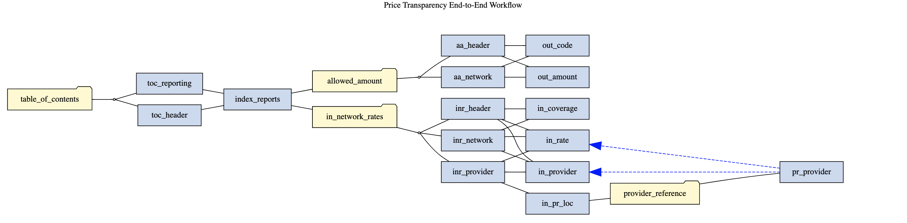

<table style="border:0px solid white; width:100%;">
    <tr>
        <td></td>
        <td align="center"><H1>Building a Lakehouse for Healthcare:  Unlocking Price Transparency</Hi></td>
    </tr>
</table>

Spark Price Transparency is python package which is part of the Databricks [Solution Accelerator](https://www.databricks.com/solutions/accelerators/price-transparency-data) for Price Transparency. The package provides guided data architecture for the import, ingest, and transform to analytic form for all Price Transparency Schemas. This repo contains demonstration material covered in the Building a Lakehouse for Healthcare: Unlocking Price Transparency on 21 MAR 2023. The package [source repository](https://github.com/databricks/hls-price-transparency) is not yet public, but a build used in the workshop is available in [PyPI](https://pypi.org/project/spark-price-transparency/).

---

## Getting Started
   The workshop material is intended to be evaluated using Databricks Repos \[ [aws](https://docs.databricks.com/repos/index.html) \| [azure](https://learn.microsoft.com/en-us/azure/databricks/repos/) \| [gcp](https://docs.gcp.databricks.com/repos/index.html)\]. Within your respective environement, You can add this repo with the following url: `https://github.com/databricks-industry-solutions/hls-price-transparency-workshop.git`

## Cluster Configuration and Dependencies
   
 * This acclerator was tested using Databricks Runtime 10.4 LTS.
 * Install [payer-mrf-streamsource-0.3.5.jar](https://github.com/databricks-industry-solutions/hls-price-transparency-workshop/releases/tag/v0.3.5-workshop) - Go to your cluster -> Libraries -> Install New -> Maven and set:
    * **Coordinates**: `databricks-industry-solutions:hls-payer-mrf-sparkstreaming:0.3.5`
    * **Repository**:  `https://github.com/databricks-industry-solutions/hls-payer-mrf-sparkstreaming/raw/maven`
 * Install [spark-price-transparency-0.1.85-py3-none-any.whl]() - Go to your cluster -> Libraries -> Install New -> PyPI and set:
    * **Package**: `spark-price-transparency==0.1.85`
    * **Repository**: `https://github.com/databricks-industry-solutions/hls-price-transparency-workshop/v0.1.85/spark-price-transparency-0.1.85-py3-none-any.whl`
 * For notebook grpahics to display, download [install_graphviz.sh](https://github.com/databricks-industry-solutions/hls-price-transparency-workshop/blob/main/init_scripts/install_graphviz.sh). Upload into a shared locaiton in dbfs. To add the init script to your cluster, go to cluster -> Configuration -> Advanced options -> Init Scripts.

## Data Architecture Overview
 
 The workshop goes over a guided data architure including code to create and populate the following entities. This view shows how the curation pattern is similar for all Price Transparency Schemas.
 
 
 
## Data Workflow Overview

 In actuality, all the Price Transparency schemas have interdependence and the guided package can be used at all workflow steps, even between the schemas.
 
 

## Sample Data Included via Delta Share

 You don't have to install and run a complete ingest to evaluate what potential Price Transparency data may have for you. Included is the workshop are instructions how to use analytic form price transparency data immediately via Delta Share. Instructions are provided in [A1_Delta_Share](https://github.com/databricks-industry-solutions/hls-price-transparency-workshop/blob/main/notebooks/A1_Delta_Share.py).

